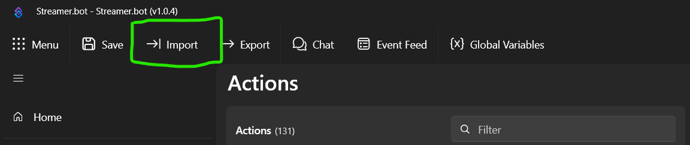

# StreamerBot Pomodoro Timer

Pomodoro Timer for Co-working streamers on Twitch, YouTube and Kick.

## Why this Task Bot?

- Browser Source is optional
  - You only need Streamer.Bot running to have it working with chat
- Compatible with Twitch, YouTube and Kick.
- Pomodoro Timer data is accessible via Streamer.Bot global variable
- Easily customizable with other Streamer.Bot actions

## Instructions

1. Install and setup [Streamer.Bot](https://streamer.bot/)
   - [Nutty's Reference Video](https://youtu.be/gfGy1gRH5ik?t=146) 

2. Open Streamer.Bot and click on Import

   > 

3. Import the string from [RythonTaskBot.sb](./RythonTaskBot.sb)

    - Copy paste the string into the `Import` box

        OR

    - Drag the file into the `Import` box

    > 

4. Click on the `Import` button

5. You may need to go to the Commands tab and enable the commands.